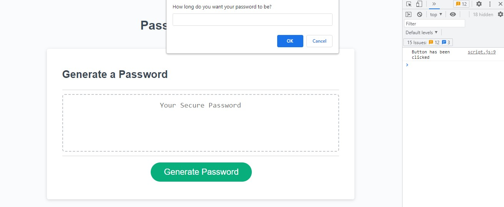
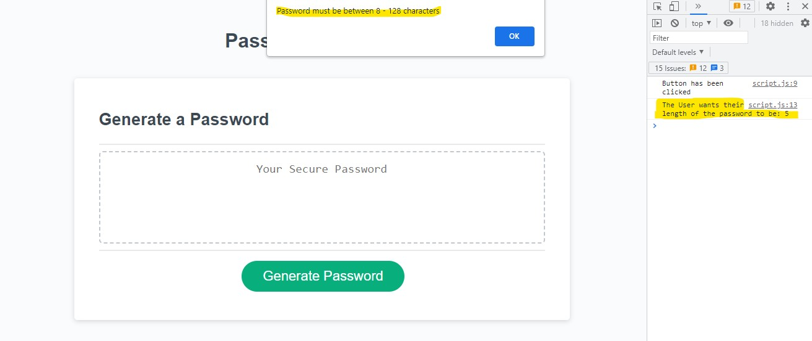
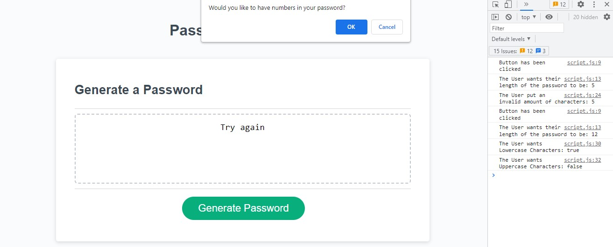
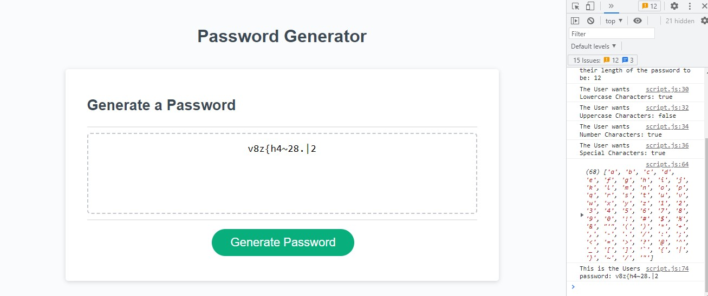

# Password Generator

## Description

As we all know the web is full of hackers so this project was created to assist making secure passwords. The page randomises a selection of characters chosen by the user ensuring to recieve hopefully a more secure password. The User has the options to choose from a variety of selections to add more security and is alerted when it doesn't meet the criteria. I learnt alot this project, creating such a large function for the arrays to be used at random, has shown me the power of what even the basic javascript really has. I struggled to get the arrays to join or to push, so it resulted me in using the concat method which I found a lot more easier to use. Using the for loop has also taken me some time to get my head around but I have used it for the User input to loop the function for the amount of characters desired for the password. 

## Usage

For this project all you have to do is press the button saying 'Generate Password'. 
You will then be prompted: 
"How long do you want your password to be?"
This will allow you to choose a length between 8 characters up to 128. If the criteria is not met you will be alerted and will have the option to try again. 

You will then be prompted four more times asking whether you would like to include: 
Uppercase Letters,
Lowercase Letter,
Numbers,
And/Or Special Characters.

Please see the images down below as reference. Take note that the right hand side is the Console Log which also assists to show the pages actions. 

The end result the page will create you randomised password using selected characters. 

To get started making your own secured password,  go to my deployed webpage:

https://ellekcir.github.io/pw-generator/

## Features

Console Log Features step by step comments to interact with page actions. Interactive prompts and selections of variety of characters.

## Credits

ADL Uni Bootcamp,

2U Tutors,

Youtube.com,

mdn web docs.

## License

MIT License

Please see LICENSE for details

